# Sentiment App With Python

This application can scrap tweets from Twitter, or get tweets from CSV(.csv) / EXCEL(.xlsx) file and label each tweet and do sentiment analytics, then display the WordCloud for each sentiment.

## Scarping Page
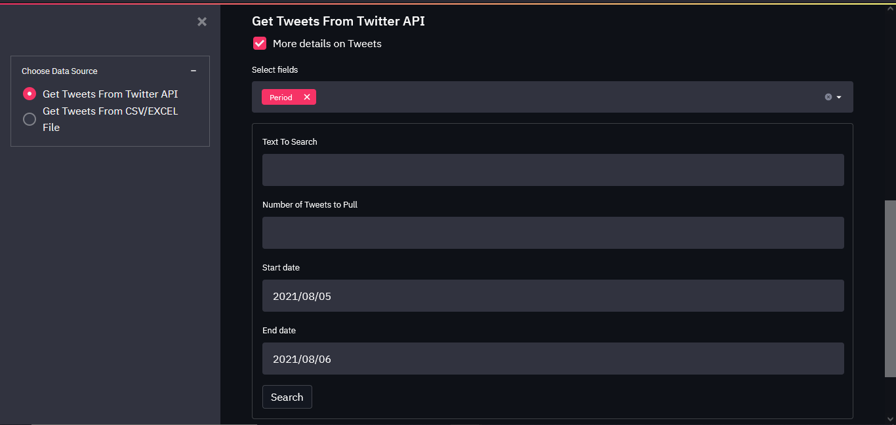
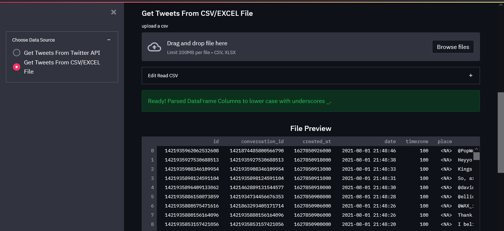
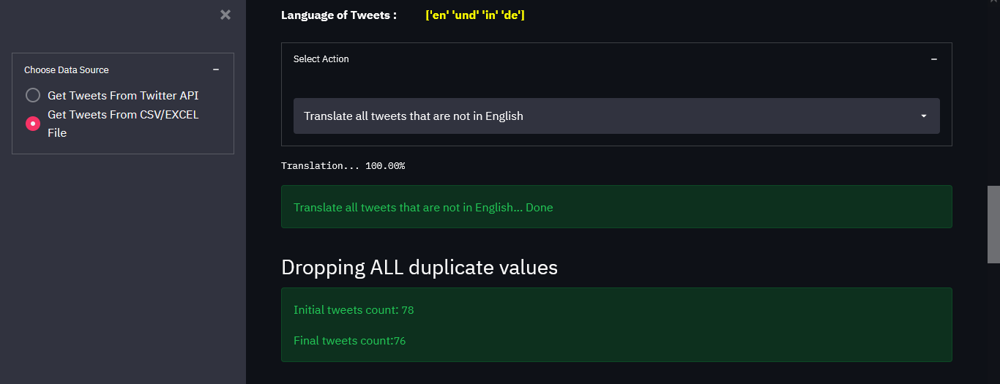
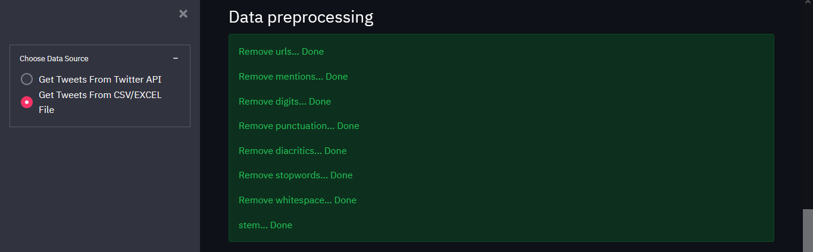
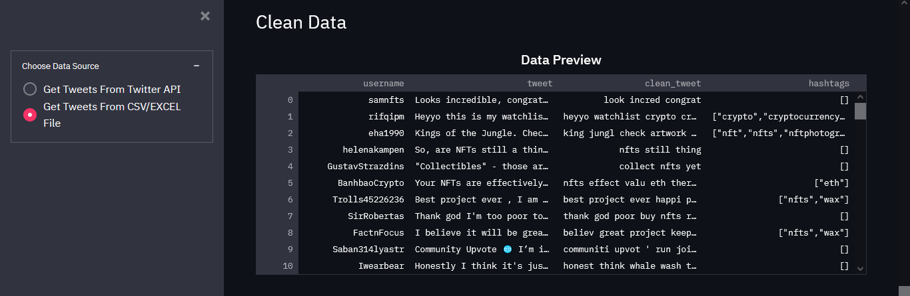
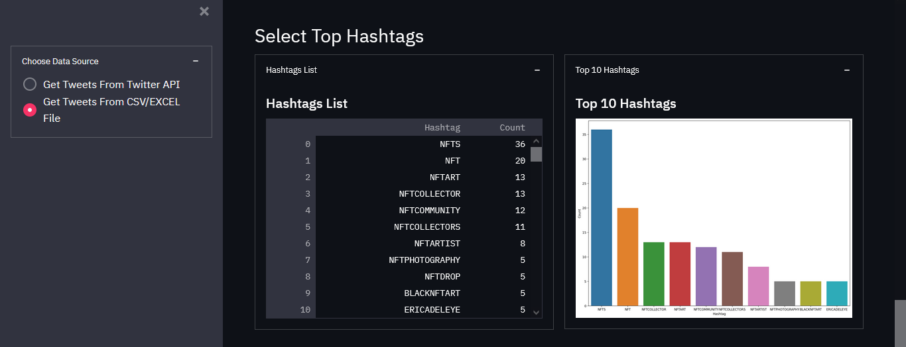
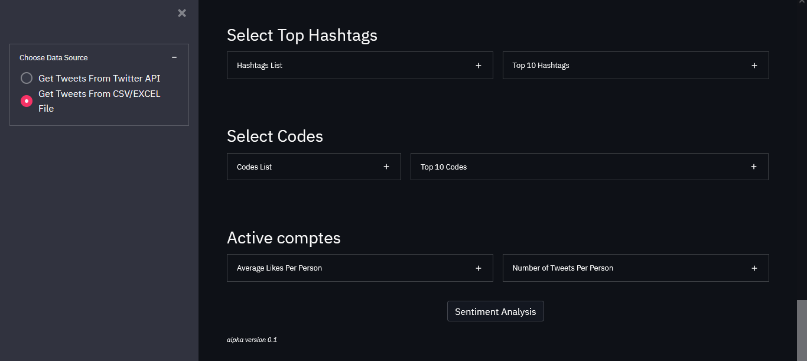

## Sentiment Page
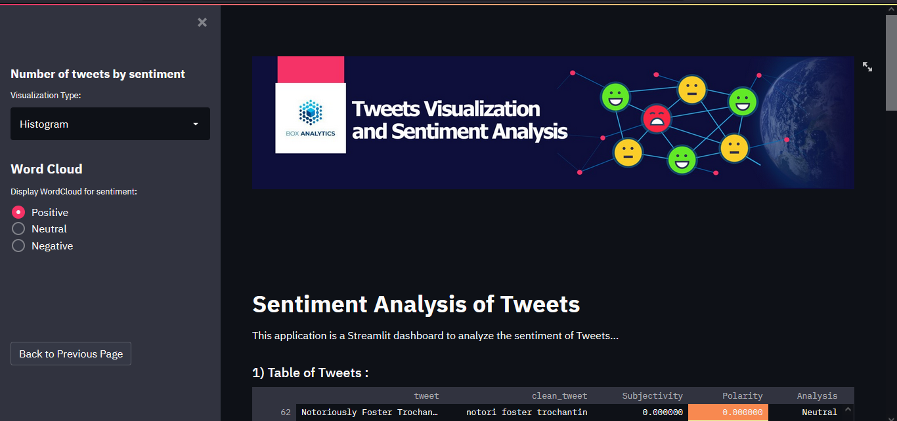
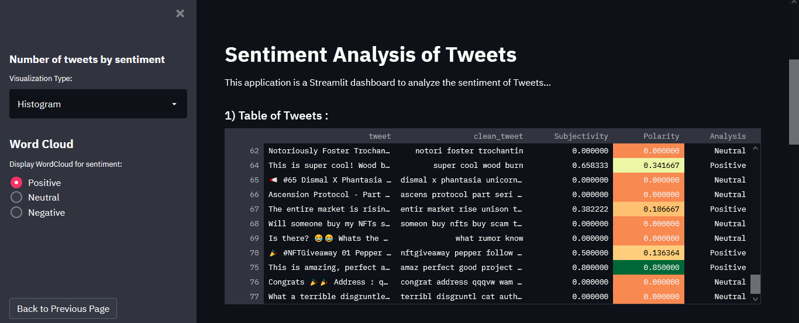
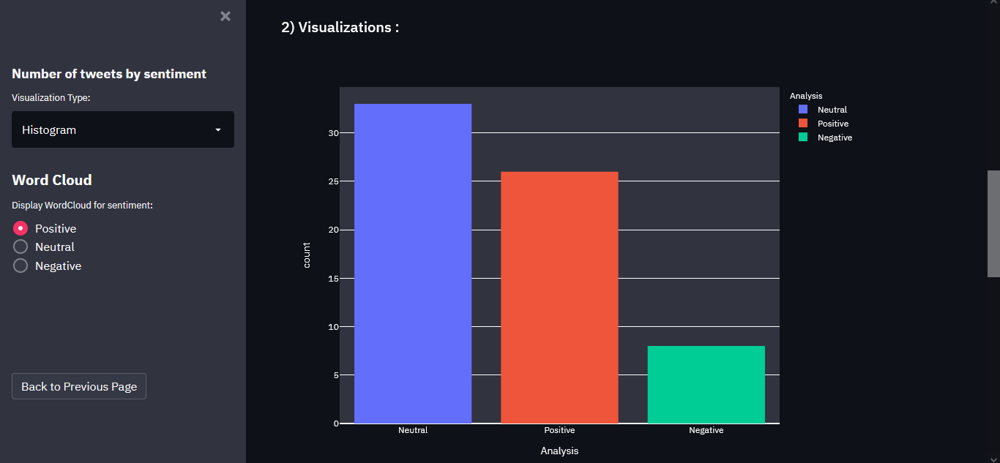
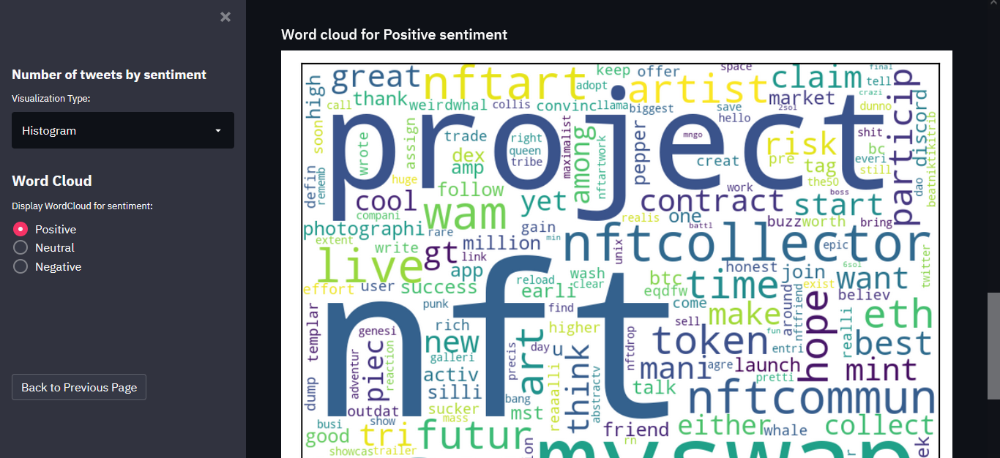

## Requirements
- Python version : 3.8.10

## Instaling Setup
Following this step to run the app :

- Clone this repo
- Create a virtual environment inside the folder
- Installing all requirements library using this command :
  ```
  pip install -r requirements.txt
  ```
- Installing twint : 
  ```
  pip install twint
  ```
- Installing dataclasses using those commands :
  ```
  pip3 install --user --upgrade git+https://github.com/twintproject/twint.git@origin/master#egg=twintt
  pip3 install --user --upgrade git+https://github.com/himanshudabas/twint.git@origin/fix-parser#egg=twint
  ```
  or those commands if you are using Pycharm or Spyder or.. :
  ```
  pip3 install --upgrade git+https://github.com/twintproject/twint.git@origin/master#egg=twintt
  pip3 install --upgrade git+https://github.com/himanshudabas/twint.git@origin/fix-parser#egg=twint
  ```
- And App is ready to running, hit this command :
  ```
  streamlit run app.py
  ```

## Libraries
Some of the main libraries that are used in this application :

- [Twint](https://github.com/twintproject/twint)
- [Streamlit](https://streamlit.io/)
- [TextBlob](https://textblob.readthedocs.io/en/dev/)